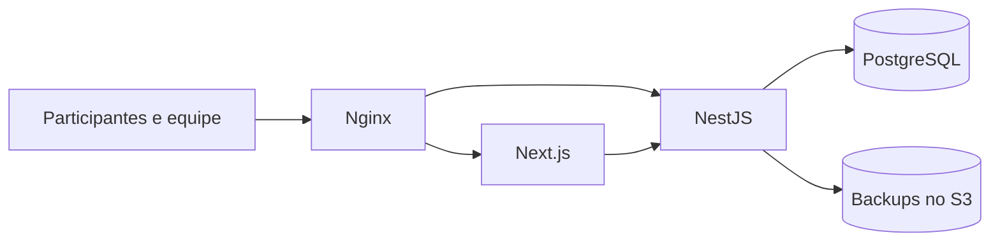

# SEMCOMP 2026 — Gamificação

Plataforma criada para gamificar a experiência dos participantes da SEMCOMP 2026. O sistema conecta atividades, pontuação, ranking e recompensas em uma jornada simples para o congressista, com ferramentas de controle, auditoria e acompanhamento para a equipe do evento.

A aplicação foi construída ao longo de 8 meses e 14 marcos, saindo de uma ideia documentada até operar em produção em [`gameficacao.semcomp.com.br`](https://gameficacao.semcomp.com.br).

## Principais funcionalidades

| Participante | Operação do evento |
| --- | --- |
| Cadastro e autenticação | Painel administrativo com perfis especializados |
| Resgate de códigos e leitura de QR Codes | Criação de atividades, códigos e lotes de QR Codes |
| Pontos, XP e rankings geral e diário | Concessão manual de pontos por participação |
| Catálogo e resgate de recompensas | Controle de estoque, entrega e estorno |
| Acompanhamento da própria jornada | Auditoria, reconciliação e exportações |

O sistema também registra presença por heartbeat, acompanha picos de acesso e mantém um livro-caixa `append-only` para rastrear alterações de saldo e operações sensíveis.

## Resultados em produção

| Métrica | Resultado |
| --- | ---: |
| Participantes cadastrados | **176** |
| Contas ativas | **175** |
| Pico de participantes online | **60** |
| Logins únicos no dia de maior movimento | **97** |
| Dias com telemetria | **6** |

Antes do evento, um ensaio de carga na AWS simulou 150 participantes autenticados e 100 resgates concorrentes, com 0% de erros, p95 de 138,92 ms nas leituras e p95 de 594,42 ms nas mutações.

## Arquitetura



- **Frontend:** Next.js 16, React 19, Tailwind CSS e TanStack Query.
- **Backend:** NestJS 11, Prisma 7 e PostgreSQL 16.
- **Infraestrutura:** Docker, Nginx e AWS provisionada com CloudFormation.
- **Segurança:** cookies `HttpOnly`, proteção CSRF, bcrypt, rate limiting, RBAC, transações atômicas e mutações idempotentes.
- **Entrega:** a CI valida testes, builds e artefatos; alterações aprovadas na `main` seguem para o deploy automático em produção.

## Executando localmente

### Pré-requisitos

- Node.js 22
- npm 11.9
- Docker com Docker Compose

Crie os arquivos de ambiente a partir de [`.env.example`](.env.example), [`apps/api/.env.example`](apps/api/.env.example) e [`apps/web/.env.example`](apps/web/.env.example), removendo o sufixo `.example` e ajustando os valores locais. Depois, execute:

```bash
npm ci
npm run db:up
npm --workspace api run prisma:generate
npm --workspace api exec prisma migrate deploy
npm run seed
npm run dev
```

O frontend ficará disponível em `http://localhost:3000`, a API em `http://localhost:3001` e a documentação Swagger em `http://localhost:3001/docs`.

Para validar o projeto:

```bash
npm --workspace api run lint:check
npm --workspace api test
npm --workspace api run test:e2e
npm --workspace web run lint
npm --workspace web test
npm run build
```

## Estrutura do repositório

```text
apps/api/                 API, banco de dados e regras de negócio
apps/web/                 Aplicação web para participantes e equipe
deploy/aws/production/    Infraestrutura e automação de produção
docs/operations/          Checklists e runbook operacional
scripts/load/             Ensaios de carga e validações
```

Para conhecer a operação de produção, consulte o [runbook do Marco 14](docs/operations/marco-14-runbook.md) e os checklists de [abertura](docs/operations/marco-14-opening-checklist.md) e [encerramento](docs/operations/marco-14-closing-checklist.md).
